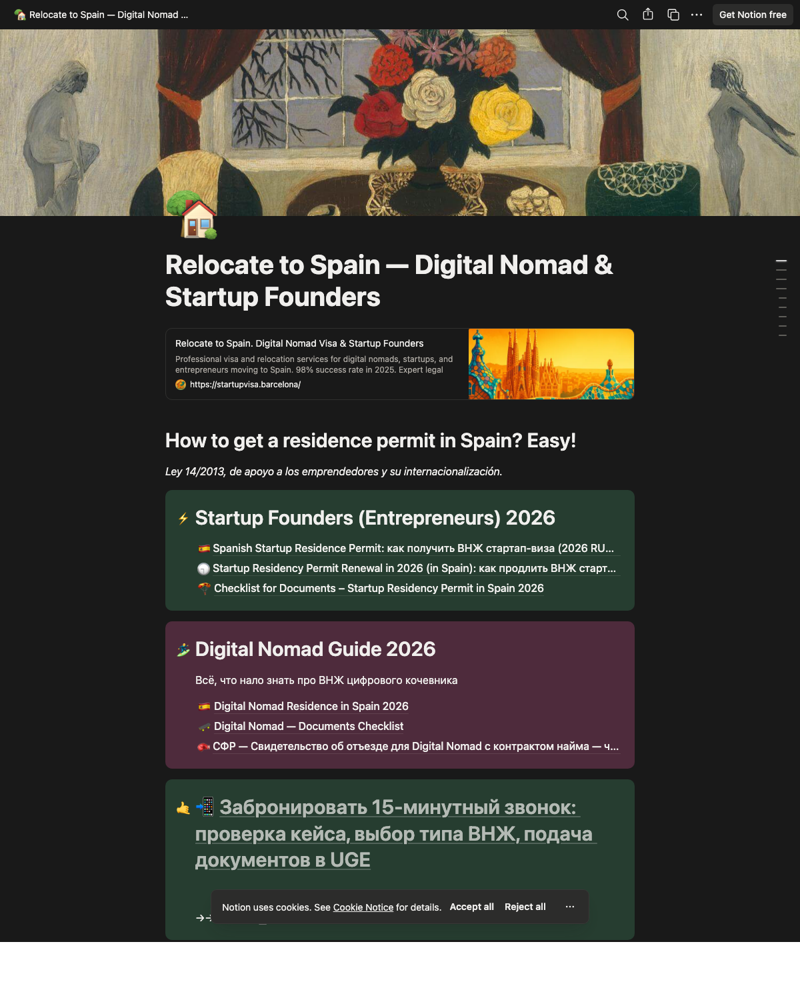
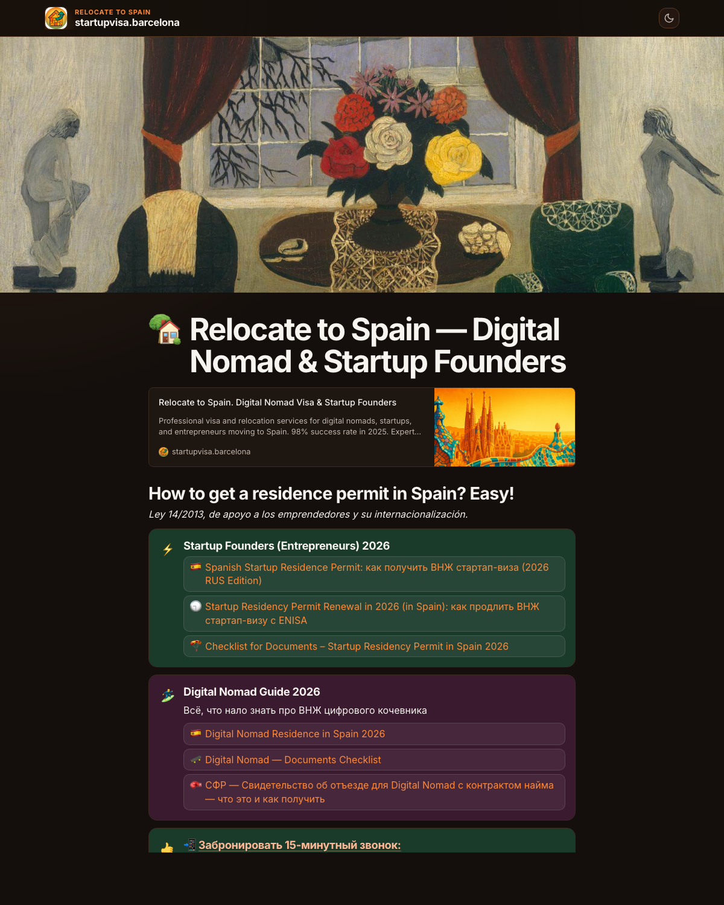

# Notion Mirror Generator

Turn any Notion page into a fast, branded, SEO-friendly website on your own domain — backed by Cloudflare Workers, with a local backup you own.

**Live example:** [spain.denyamsk.ru](https://spain.denyamsk.ru) (mirrored from a Notion workspace)

## Notion source → Deployed mirror

<table>
<tr>
<th width="50%">Notion (source)</th>
<th width="50%">Mirror (deployed)</th>
</tr>
<tr>
<td><a href="https://barcelona-startups-relocation.notion.site/Relocate-to-Spain-Digital-Nomad-Startup-Founders-1372979b1b584059bd83d19bbbafa985"></a></td>
<td><a href="https://spain.denyamsk.ru/"></a></td>
</tr>
</table>

Same content, same page tree, but now served from your own domain with custom branding, fast CDN caching, rich bookmark previews, a generated sitemap, optional Google Analytics, short links, and a private local backup.

## What it does

1. **Scaffolds** a new Cloudflare Workers project from a template, wiring up your Notion page ID, domain, branding, and analytics.
2. **Backs up** every page reachable from your root page to local JSON + static HTML — you own a full copy that works offline.
3. **Previews** the backup locally at `http://localhost:8788` before you deploy.
4. **Deploys** to Cloudflare with one script: KV namespace + R2 bucket + secrets + custom domain.
5. **Warms** the cache from your local backup so the first visitor hits a pre-rendered page.

## Quick start

### Prerequisites

- **[Bun](https://bun.sh)** for running the generator and scripts
- **Notion integration token** ([how to create one](https://developers.notion.com/docs/create-a-notion-integration))
- **Cloudflare account** with a domain on Cloudflare DNS (for deploying — optional for local preview)
- **Claude Code** ([install](https://docs.claude.com/claude-code)) — this repo ships as a Claude Code skill

### 1. Clone and build

```sh
git clone https://github.com/denya/notion-mirror-generator.git
cd notion-mirror-generator
bun install
bun run build
```

### 2. Run the skill in Claude Code

Open Claude Code in this directory and invoke:

```
/setup-notion-mirror
```

Claude will guide you through:

1. Choosing local-only backup or full Cloudflare deploy
2. Collecting your Notion root page URL and integration token
3. Scaffolding a new project into `data/sites/<your-slug>/`
4. Running the local backup and localhost preview
5. Setting up Cloudflare (via the bundled `setup-cloudflare` skill)
6. Deploying the worker and warming the cache

All answers are remembered per session — you can stop after step 4 if you only want a local backup today.

### 3. Manual path (without Claude)

Prefer running it yourself? The CLI works standalone:

```sh
node dist/cli/index.js init-mirror data/sites/my-site
cd data/sites/my-site
bun install
bun run setup             # creates .env and .dev.vars
export NOTION_API_KEY=ntn_...
bun run backup            # public-pages backup (root crawl)
bun run serve:local       # localhost preview
./deploy.sh               # deploy to Cloudflare
source .env && bun run warm:fast  # pre-render all pages into KV
```

## Features

- **Full local backup** — every public page downloaded as JSON + static HTML you can serve offline
- **Rich bookmark cards** — Notion link blocks render with OG title, description, favicon, and thumbnail (warmed at build time)
- **Table of Contents** — optional public `/toc` page with page hierarchy, grouped public/private
- **Image proxy** — Notion's expiring signed URLs cached permanently in R2
- **Dark mode** — theme toggle with `prefers-color-scheme` fallback
- **SEO** — auto-generated sitemap.xml, OG metadata per page, canonical URLs, breadcrumbs
- **Short links** — configurable `/slug → long-page-url` redirects (302/301)
- **Custom branding** — logo, theme color, footer, favicon, Google Analytics
- **Fast cache warming** — `warm:fast` re-renders all pages from local snapshots in seconds, no Notion API calls
- **Workspace vs public scope** — separate `backup` (public) and `backup:workspace` (includes private pages) commands
- **Config from wrangler.toml** — single source of truth; local scripts read vars at runtime, no rebuild needed after config changes

## How it works

Two halves:

**Local half** (`scripts/`)
- `backup-site.ts` walks your Notion page tree via the official API, downloads every page, renders HTML with the same template the Worker uses, and saves it to `data/sites/<slug>/`.
- `serve-local.ts` serves the static backup at `localhost:8788` with a footer TOC link.
- `warm-cache.ts` re-renders pages from the local snapshots and uploads to Cloudflare KV — fast enough that you can preview any renderer change in seconds.

**Cloudflare half** (`src/`)
- A Hono-based Worker (`src/index.ts`) serves pages from KV, falls back to Notion API on miss, and proxies images through R2.
- `src/template.ts` renders a Notion-like page with your branding applied.
- `src/renderer.ts` handles every Notion block type (headings, callouts, toggles, tables, bookmarks, etc.).
- `wrangler.toml` holds all config as plain `[vars]` — change a value, redeploy.

## Project structure

```
notion-mirror-generator/
├── skills/
│   ├── setup-notion-mirror/     # Main entry-point skill
│   ├── setup-cloudflare/         # Cloudflare account + auth helper
│   └── site-warmup/              # Warm cache after template changes
├── templates/
│   └── notion-mirror/            # Source template — scaffolded into each new site
│       ├── src/                  # Worker code (Hono, renderer, cache, template)
│       ├── scripts/              # Local backup, serve, warm, setup scripts
│       ├── wrangler.toml         # Cloudflare config with EJS placeholders
│       └── deploy.sh             # One-shot deploy script
├── src/cli/                      # The generator CLI itself (init-mirror command)
└── data/                         # Generated sites live here (gitignored)
    └── sites/<slug>/             # Each site is a full standalone project
```

## For AI agents

This repo is a **Claude Code skill**. If you're an AI assistant invoked in this directory, the main entry point is the `setup-notion-mirror` skill at `skills/setup-notion-mirror/SKILL.md`. It:

- Asks local-only vs full-deploy first
- Delegates Cloudflare setup to `setup-cloudflare` skill
- Delegates cache warming guidance to `site-warmup` skill
- Produces a fully-configured site in `data/sites/<slug>/`

Generated sites are **gitignored** — never commit anything under `data/`. Each generated site is standalone and has its own git repo if the user wants one.

Template files use EJS placeholders (`<%- jsString(foo) %>`) that get rendered at scaffold time. Runtime config is read from `wrangler.toml` via `readWranglerVars()` in `scripts/site-data.ts` — this is the single source of truth, not the EJS defaults.

## License

MIT. Based on the original [NoteHost](https://github.com/velsa/notehost) project by Vels Lobak.
